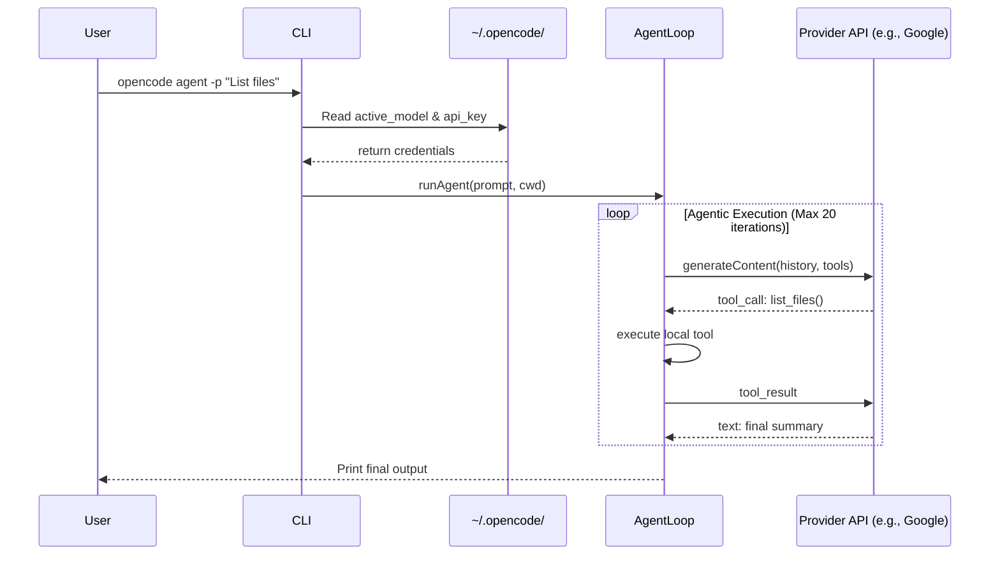

# Opencode

Opencode is a specialized, agentic Command Line Interface (CLI) tool designed to integrate Large Language Models (LLMs) directly into the local development workflow. Built with a focus on extensibility and provider abstraction, it allows developers to securely manage multiple API keys, inspect remote model capabilities, and run autonomous agentic loops with local filesystem and shell execution context.

## Architecture & Design

The project is structured into three distinct layers to ensure modularity:
- **CLI Routing (`commands/`)**: Parses arguments and flags via Commander.js.
- **Core Library (`lib/`)**: Handles business logic, including secure credential management, network caching, and the core agent execution loop.
- **Presentation (`ui/`)**: Abstracts terminal styling and standardizes standard output/error formatting.

### System Workflow



## Features

- **Provider Abstraction**: Framework supports configuring multiple AI providers (Google, OpenAI, Anthropic, etc.).
- **Local Secure Storage**: API credentials and configuration are stored locally in `~/.opencode/` with strict `0600` permissions.
- **Model Discovery & Caching**: Connects to `models.dev` to fetch, filter, and cache remote model schemas, context limits, and tool-call capabilities.
- **Agentic Loop Integration**: Includes an extensible tool-calling framework out-of-the-box (`list_files`, `read_file`, `run_command`), enabling the LLM to autonomously inspect and manipulate the local workspace.

## Previews

<div align="center">
  
  <br />
  
</div>

## Installation

> **Note:** The npm sidebar shows `npm i @joshxdevs/opencode` — that is for installing as a library dependency. Since opencode is a CLI tool, always install it with the `-g` (global) flag as shown below.

### Via npm (recommended)

```bash
npm install -g @joshxdevs/opencode
```

### Via Bun

```bash
bun add -g @joshxdevs/opencode
```

### From Source

Clone the repository and install dependencies:

```bash
git clone https://github.com/joshxdevs/opencode.git
cd opencode
bun install
bun link
```

## Usage Guide

### Managing Providers
Securely store your API keys locally.

```bash
opencode providers login --provider google --api_key YOUR_API_KEY
opencode providers list
opencode providers logout --provider google
```

### Managing Models
List available models and configure your active default.

```bash
# View all available models
opencode models

# Filter by a specific provider and force cache refresh
opencode models --provider google --refresh

# Set the active model for agent execution
opencode model set google/gemini-2.5-flash
```

### Running the Agent
Trigger the agent loop with a specific prompt. The agent executes within the current working directory.

```bash
opencode agent -p "Analyze the files in this directory and summarize their purpose."
```

## Development

The project is built using TypeScript. To compile the code into the `dist` directory:

```bash
bun run build
```

To run the CLI in development mode without linking:

```bash
bun cli.ts [command]
```

## License

MIT
